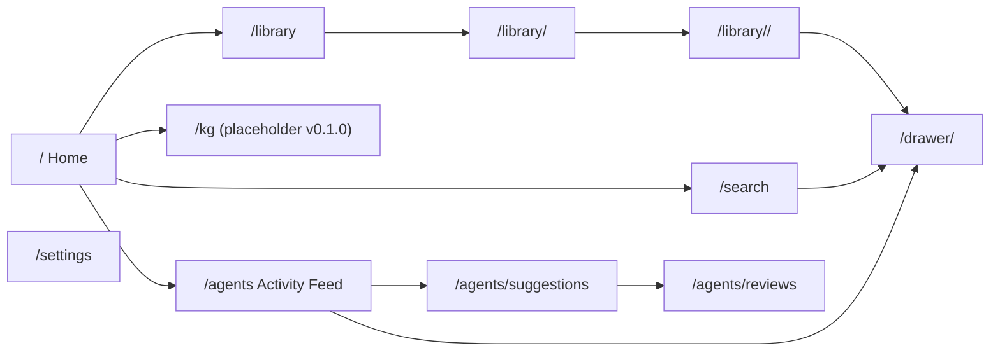
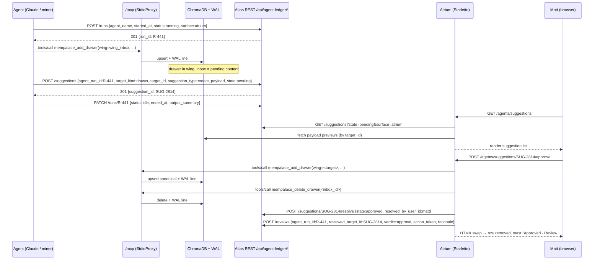

# Atrium — Mockups (v0.1.2)

| Field | Value |
|---|---|
| Document | Atrium (MemPalace Visualization Layer) — Wireframes |
| Tool name | **Atrium** (locked v0.1.1 per Matt) |
| Version | v0.1.2 |
| Supersedes | v0.1.1 (in-file stamp; filename retained per convention) → v0.1.0 |
| Date | 2026-04-28 |
| Companion | `01-mempalace-ui-discovery-v0.1.0.md` (in-file v0.1.1), `02-mempalace-ui-prd-v0.1.0.md` (in-file v0.1.1), `Claude Workspace\Claude Projects\Governance Documents\Atlas_Agent_Activity_Ledger_Schema_v0.1.0.md` (shared ledger schema) |
| Fidelity | ASCII layouts + Mermaid diagrams. Not pixel-perfect. Captures layout + the data each screen surfaces. |

> **v0.1.2 changelog (this doc).** Added §2.8 sub-section for the Persona Registry editor in the Settings page (per PRD §13). Mockups remain ASCII-fidelity; the editor renders inside Settings as a list-of-personas with inline tier dropdowns. No other screens changed.
>
> **v0.1.1 changelog (carried forward).** (1) Tool name locked: **Atrium** (was working name; now canonical). (2) §2.6 Suggestions Queue redrawn against the formal `agent_run_id` / `agent_suggestions` / `agent_persona_registry` fields — each row now exposes persona, governance_tier, suggestion_id, run_id. (3) §2.7 Reviews redrawn against `agent_reviews` rows — verdict column carries the formal enum (`approve` / `decline` / `request_changes`); confidence_score and rationale shown. (4) §6 Mermaid sequence updated — every approval now writes both the canonical drawer AND a `POST /api/agent-ledger/reviews` call.
>
> Versioning policy: this doc is `v0.1.1`. When tokens are re-cited against UI/UX v1.5, this becomes v0.1.2.

---

## 1. Navigation Frame

### 1.1 Sidebar (220 px expanded, 60 px collapsed)

Per UI/UX v1.4 §Sidebar Navigation Standards. Icon + Label always paired.

```
┌──────────────────────────┐
│ [≡] Atrium               │  ← logo + collapse toggle
├──────────────────────────┤
│ [🏠] Home                │  ← active item: 3 px left-border accent in --accent-blue
│ [📚] Library             │
│ [🔍] Search              │
│ [🕸] Knowledge Graph    │  ← v0.1.0 = placeholder table
│ ─────────────            │
│ [🤖] Agents              │  ← expandable
│     · Activity Feed      │
│     · Suggestions  (3)   │  ← unread badge from wing_inbox count
│     · Reviews            │
├──────────────────────────┤
│ [⚙] Settings            │  ← bottom group
│ [👤] Matt Brown         │
│ [🌗] Adaptive            │  ← cycles Light → Dark → Adaptive
└──────────────────────────┘
```

Collapsed (60 px) shows only the icons — same vertical order, same active-state accent.

### 1.2 Top bar (44 px, sticky)

```
┌──────────────────────────────────────────────────────────────────────────────┐
│ [≡] Library  ›  wing_iep  ›  vendors                       [/] Search…  [?] │
└──────────────────────────────────────────────────────────────────────────────┘
```

- Left: hamburger (mobile) + breadcrumb. Breadcrumb is server-rendered from the route.
- Right: search-anywhere (`/` keyboard shortcut focuses), help.

### 1.3 Top-level layout

```
┌──────┬───────────────────────────────────────────────────────────────────────┐
│ side │ TOP BAR                                                              │
│ bar  ├───────────────────────────────────────────────────────────────────────┤
│      │                                                                       │
│      │  PAGE CONTENT                                                         │
│      │  (per-screen layout below — never below 200 px / above 300 px sidebar │
│      │  on desktop, off-canvas on mobile per UI/UX v1.4)                     │
│      │                                                                       │
└──────┴───────────────────────────────────────────────────────────────────────┘
```

### 1.4 Mermaid — site map



---

## 2. Screens

### 2.1 Palace Overview / Home  —  `GET /`

```
┌──────────────────────────────────────────────────────────────────────────────┐
│ [🏠] Home                                                                    │
├──────────────────────────────────────────────────────────────────────────────┤
│  ┌──────────┐ ┌──────────┐ ┌──────────┐ ┌──────────┐                         │
│  │ DRAWERS  │ │ WINGS    │ │ TRIPLES  │ │ AGENTS   │   ← .atlas-stat tiles   │
│  │ 12 437   │ │   4      │ │   386    │ │    7     │                         │
│  └──────────┘ └──────────┘ └──────────┘ └──────────┘                         │
│                                                                              │
│  Wings ────────────────────────────────────────────────────  [grid 2×2]      │
│  ┌──────────────────────┐ ┌──────────────────────┐                            │
│  │ wing_iep        4 812│ │ wing_atlas      3 207│   ← .atlas-card           │
│  │ ▌ vendors      1 022 │ │ ▌ technical    1 488 │     wing name + count     │
│  │ ▌ events         901 │ │ ▌ decisions      612 │     top-3 rooms by count  │
│  │ ▌ timelines      655 │ │ ▌ deployment     444 │     last touched →        │
│  │  Last touched 2h ago │ │  Last touched 12m ago│                           │
│  └──────────────────────┘ └──────────────────────┘                            │
│  ┌──────────────────────┐ ┌──────────────────────┐                            │
│  │ wing_mega       2 511│ │ wing_personal    907 │                           │
│  └──────────────────────┘ └──────────────────────┘                            │
│                                                                              │
│  Recent activity ─────────────────────────────────────────  [feed, 25 rows]  │
│  ┌────────────────────────────────────────────────────────────────────────┐  │
│  │ 14:02 [add_drawer]   wing_iep / vendors  · "ACME catering quote rcvd"   │  │
│  │ 13:58 [kg_add]       Max → does → swimming   (since 2025-01-01)         │  │
│  │ 13:45 [diary_write]  agent: claude-mining   topic: phase-4-slice         │  │
│  │ 13:31 [add_drawer]   wing_inbox / claude-mining-events · pending review │  │
│  │ …                                                                      │  │
│  └────────────────────────────────────────────────────────────────────────┘  │
│  Auto-refresh every 5 s (HTMX hx-trigger="every 5s")                         │
└──────────────────────────────────────────────────────────────────────────────┘
```

**Data:** `tool_status`, `tool_kg_stats`, paginated metadata sweep, **`GET /api/agent-ledger/runs?surface=atrium&order=-started_at&limit=25`** for the right-rail Recent activity feed (was: WAL JSONL tail in v0.1.0; v0.1.1 prefers the formal `agent_runs` ledger and falls back to WAL only when the Atlas API is unreachable — see PRD §4.3).

### 2.2 Drawer Browser  —  `GET /library`, `/library/<wing>`, `/library/<wing>/<room>`, `/drawer/<id>`

#### 2.2.a Wing list

```
┌──────────────────────────────────────────────────────────────────────────────┐
│ Library                                                                      │
├──────────────────────────────────────────────────────────────────────────────┤
│  Wing                       Drawers   Last touched      Halls present        │
│  ───────────────────────── ─────── ─────────────── ───────────────────────── │
│  wing_iep                    4 812    2h ago         events, vendors, …      │
│  wing_atlas                  3 207    12m ago        technical, decisions, … │
│  wing_mega                   2 511    1d ago         budgets, team, …        │
│  wing_personal                 907    4d ago         creative, diary, …      │
│  wing_inbox                     3 ⊕   45m ago        pending →               │
│  wing_claude-mining           114    20m ago        diary                    │
└──────────────────────────────────────────────────────────────────────────────┘
```

#### 2.2.b Room list inside a wing

```
┌──────────────────────────────────────────────────────────────────────────────┐
│ Library  ›  wing_iep                                                         │
├──────────────────────────────────────────────────────────────────────────────┤
│  Room                            Drawers   Halls    Last touched             │
│  ────────────────────────────── ───────── ──────── ───────────────           │
│  vendors-catering-selections      214      vendors    2h ago                 │
│  gala-2026-spring                 188      events     8h ago                 │
│  venue-grandball-layout           93       venues     2d ago                 │
│  acme-account                     67       clients    14h ago                │
│  …                                                                           │
│  [filter halls ▾] [sort: count ▾]                                            │
└──────────────────────────────────────────────────────────────────────────────┘
```

#### 2.2.c Drawer list inside a room

```
┌──────────────────────────────────────────────────────────────────────────────┐
│ Library  ›  wing_iep  ›  vendors-catering-selections             [↻ Refresh] │
├──────────────────────────────────────────────────────────────────────────────┤
│  Filed at        Added by    Source              Preview                     │
│  ─────────────── ─────────── ───────────────── ─────────────────────────── │
│  2026-04-28 14:02  mcp        claude-export-…    "ACME catering quote …"     │
│  2026-04-28 11:30  miner      contracts/…pdf     "Subcontractor agreement …" │
│  …                                                                           │
│  ◀ 1 2 3 … 11 ▶                                                              │
└──────────────────────────────────────────────────────────────────────────────┘
```

#### 2.2.d Drawer detail  —  `/drawer/<id>` (8-zone layout per UI/UX v1.4)

```
┌──────────────────────────────────────────────────────────────────────────────┐
│ 1. BREADCRUMB · Library › wing_iep › vendors-…                               │
│    DRAWER drawer_iep_vendors_8a3f...   filed 2026-04-28 14:02 by mcp         │
│                                       [✏ Edit] [📁 Move] [⋮ More]            │  ← Quick Actions, max 4
├──────────────────────────────────────────────────────────────────────────────┤
│ 2. STATUS BAR ─ canonical · indexed · in-graph · WAL-row #5021              │
├──────────────────────────────────────────────────────────────────────────────┤
│ 3. (no stage checklist for v0.1.0 — reserved for v0.2.0+)                   │
├──────────────────────────────────────────────────────────────────────────────┤
│ 4. CONTENT (verbatim)                                                        │
│    ┌────────────────────────────────────────────────────────────────────┐    │
│    │ ACME catering quote received: $12 400 for 240 plated guests, …     │    │
│    │ … (full chunk, monospace) …                                        │    │
│    └────────────────────────────────────────────────────────────────────┘    │
│ 5. ACTIONS  [Open in Search]  [Copy permalink]  [View raw JSON]              │
├──────────────────────────────────────────────────────────────────────────────┤
│ 6. METADATA panel                                                             │
│    wing: wing_iep · room: vendors-… · hall: hall_vendors                     │
│    chunk_index: 0 · source_file: contracts/acme-2026.md                      │
├──────────────────────────────────────────────────────────────────────────────┤
│ 7. RELATED                                                                    │
│    · 4 other drawers in this room                                            │
│    · KG triples mentioning ACME (3) — link to /kg?entity=ACME               │
├──────────────────────────────────────────────────────────────────────────────┤
│ 8. ACTIVITY FEED for this drawer                                             │
│    2026-04-28 14:02 add_drawer by mcp                                        │
└──────────────────────────────────────────────────────────────────────────────┘
```

The "⋮ More" overflow contains: Pin · Copy ID · Open WAL row · Delete (red, divider).

### 2.3 Search  —  `GET /search?q=...`

```
┌──────────────────────────────────────────────────────────────────────────────┐
│ Search                                                                       │
│ ┌──────────────────────────────────────────────────────────────────┐ [Go]    │
│ │ ACME catering quote                                               │         │
│ └──────────────────────────────────────────────────────────────────┘         │
│  Wing: [all ▾]   Room: [all ▾]   Limit: [10 ▾]   Date: [any ▾]              │
├──────────────────────────────────────────────────────────────────────────────┤
│  3 results · sanitizer applied stage 0 (untouched)                            │
│  ──────────────────────────────────────────────────────────────────────────  │
│  ★ 0.92  wing_iep / vendors-catering-selections                              │
│           "ACME catering **quote** received: $12 400 for 240 plated …"       │
│           drawer_iep_vendors_8a3f… · 2026-04-28                              │
│  ──────────────────────────────────────────────────────────────────────────  │
│  ★ 0.81  wing_iep / acme-account                                              │
│           "ACME — repeat client, 5★, **catering** preferences include …"    │
│  ──────────────────────────────────────────────────────────────────────────  │
│  ★ 0.74  wing_atlas / decisions                                               │
│           "Decision: ACME approved Q4 budget over **catering** line …"      │
└──────────────────────────────────────────────────────────────────────────────┘
```

Match terms bolded server-side (regex over the matched span). Bullet badges = halls. Click → drawer detail.

### 2.4 Knowledge Graph (placeholder for v0.1.0)  —  `GET /kg`

```
┌──────────────────────────────────────────────────────────────────────────────┐
│ Knowledge Graph                                  [v0.2.0 will visualize]     │
│ Stats: 386 triples · 142 entities · 12 predicates · 41 expired               │
├──────────────────────────────────────────────────────────────────────────────┤
│  Top entities (by triple count)        Predicates                             │
│  ─────────────────────────────         ────────────────────                   │
│  Max ............................ 23   does ............ 47                  │
│  Alice ........................... 18   loves ........... 31                  │
│  ACME ............................ 14   works_on ........ 28                  │
│  …                                       …                                    │
│                                                                              │
│  Timeline (last 25 facts) ─────────────────────────────────────────────────  │
│   2026-04-28  Max → does → swimming  (since 2025-01-01)                      │
│   2026-04-27  ACME → repeat_client → IEP                                     │
│   …                                                                          │
└──────────────────────────────────────────────────────────────────────────────┘
```

Entity click → `/kg?entity=<name>` (a `tool_kg_query` page with timeline + connected entities). Cytoscape canvas slot reserved for v0.2.0.

### 2.5 Agent Activity Feed  —  `GET /agents`

Primary view: collapsed `agent_runs` rows; expand to see WAL byte-level + suggestion/review chains within the run window.

```
┌────────────────────────────────────────────────────────────────────────────────────┐
│ Agents · Activity Feed                                  [Filter ▾]  [Auto-refresh] │
├────────────────────────────────────────────────────────────────────────────────────┤
│ Run     Started    Ended     Agent           Status   Surface  Suggestions  Reviews│
│ ──────  ─────────  ────────  ──────────────  ───────  ───────  ───────────  ───────│
│ R-441 ▾ 13:30      13:32     claude-export   idle     atrium       2            2  │
│   └─ SUG-2814 wing_iep/vendors-acme   pending → approved at 13:31  by matt         │
│   └─ SUG-2816 wing_atlas/decisions    pending → approved at 13:32  by matt         │
│   └─ WAL 13:30:14 add_drawer wing_inbox/claude-export-vendors-acme                 │
│   └─ WAL 13:31:02 add_drawer wing_iep/vendors-acme   (canonical)                   │
│   └─ WAL 13:31:02 delete_drawer drawer_iep_inbox_…                                 │
│ ──────────────────────────────────────────────────────────────────────────────────│
│ R-442 ▸ 13:18      13:19     claude-mining   idle     atrium       1            1  │
│ ──────────────────────────────────────────────────────────────────────────────────│
│ R-443 ▸ 13:14       —        mcp(matt)       running  atrium       0            0  │
│ ──────────────────────────────────────────────────────────────────────────────────│
│ R-440 ▸ 12:50      12:52     claude-export   idle     both         3            3  │
│  ◀ 1 2 3 … ▶   page size 50                                                        │
├────────────────────────────────────────────────────────────────────────────────────┤
│  Diary panel (right rail, toggle)                                                  │
│  ─────────────────────────────────                                                 │
│  claude-mining · 13:45 · phase-4                                                   │
│   "SESSION:2026-04-28|staged.67.convos|⚠.ingest.deferred|★★★"                    │
└────────────────────────────────────────────────────────────────────────────────────┘
```

Field mapping (formal schema → UI):

| `agent_runs` column | Rendered as |
|---|---|
| `id` | "Run R-NNN" |
| `started_at` / `ended_at` | "Started" / "Ended" columns |
| `agent_name` | "Agent" |
| `status` enum | "Status" (running / idle / error / blocked) |
| `surface` | "Surface" |
| count of `agent_suggestions` WHERE `agent_run_id = id` | "Suggestions" |
| count of `agent_reviews` WHERE `agent_run_id = id` | "Reviews" |
| `parent_run_id` | indented child-run rendering |

Status badges:
- `add_drawer` → 🟢 green pill
- `delete_drawer` → 🔴 red pill
- `kg_add` → 🔵 blue pill
- `kg_invalidate` → 🟠 amber pill
- `diary_write` → 🟣 purple pill (per UI/UX v1.4 status palette)

### 2.6 Agent Suggestions Queue  —  `GET /agents/suggestions`

Data source: `GET /api/agent-ledger/suggestions?state=pending&surface=atrium` (joined with `agent_runs` and `agent_persona_registry`). Each card maps 1:1 onto an `agent_suggestions` row.

```
┌────────────────────────────────────────────────────────────────────────────────┐
│ Agents · Suggestions Queue                                  3 pending          │
├────────────────────────────────────────────────────────────────────────────────┤
│  ┌──────────────────────────────────────────────────────────────────────────┐  │
│  │ SUG-2814   ·   run R-441   ·   tier: approval_gated   ·   filed 13:31    │  │
│  │ claude-export   "Cartographer / Magellan"                                │  │
│  │ suggestion_type: create   target: drawer   →   wing_iep / vendors-acme   │  │
│  │ ┌─ payload preview (from ChromaDB drawer_iep_inbox_…) ────────────────┐  │  │
│  │ │ "Subcontractor agreement for LA Fairgrounds vendor work — terms:   │  │  │
│  │ │  45-day net, $8 200 total, indemnification clause §4.2 …"          │  │  │
│  │ └────────────────────────────────────────────────────────────────────┘  │  │
│  │ confidence: 0.82   ·   parent_run: —                                    │  │
│  │ [✓ Approve]   [✏ Edit]   [✕ Reject]                                     │  │
│  └──────────────────────────────────────────────────────────────────────────┘  │
│  ┌──────────────────────────────────────────────────────────────────────────┐  │
│  │ SUG-2815   ·   run R-442   ·   tier: supervised   ·   filed 13:18        │  │
│  │ claude-mining   "Cartographer / Mercator"                                │  │
│  │ suggestion_type: create   target: drawer   →   wing_iep / events-gala-…  │  │
│  │ "GALA2026 confirmed venue: Grand Ballroom · cap 500 · Sat load-in"       │  │
│  │ confidence: 0.95                                                         │  │
│  │ [✓ Approve]   [✏ Edit]   [✕ Reject]                                      │  │
│  └──────────────────────────────────────────────────────────────────────────┘  │
│  ┌──────────────────────────────────────────────────────────────────────────┐  │
│  │ SUG-2816   ·   run R-441   ·   tier: approval_gated   ·   filed 12:50    │  │
│  │ claude-export   "Cartographer / Magellan"                                │  │
│  │ suggestion_type: create   target: drawer   →   wing_atlas / decisions    │  │
│  │ "TECH-07 batch routing decision …"                                       │  │
│  │ confidence: 0.71                                                         │  │
│  │ [✓ Approve]   [✏ Edit]   [✕ Reject]                                      │  │
│  └──────────────────────────────────────────────────────────────────────────┘  │
└────────────────────────────────────────────────────────────────────────────────┘
```

Field mapping (formal schema → UI):

| `agent_suggestions` column | Rendered as |
|---|---|
| `id` | "SUG-NNNN" badge |
| `agent_run_id` | "run R-NNN" badge |
| `agent_run.agent_name` (joined) | agent label |
| `agent_persona_registry.persona_archetype / persona_label` (joined on agent_name) | quoted persona, e.g. `"Cartographer / Magellan"` |
| `agent_persona_registry.governance_tier` | "tier: …" badge (auto / supervised / approval_gated) |
| `suggestion_type` | "suggestion_type: …" inline label |
| `target_kind` + `target_id` | resolved to "wing/room" via ChromaDB drawer fetch |
| `payload.confidence` (JSONB) | "confidence: 0.NN" |
| `created_at` | "filed HH:MM" |
| `parent_run_id` (via `agent_runs`) | "parent_run:" line when non-null |

**Edit flow** (HTMX inline replace):

```
┌──────────────────────────────────────────────────────────────────────────────┐
│ SUG-2814  ·  run R-441  ·  claude-export  /  Cartographer · Magellan          │
│                                              [editing — agent draft]          │
│ ┌──────────────────────────────────────────────────────────────────────────┐ │
│ │ Subcontractor agreement for LA Fairgrounds vendor work — terms: …        │ │
│ │ 45-day net, $8 200 total, indemnification clause §4.2 …                  │ │
│ │ [textarea, monospaced, ~12 rows]                                         │ │
│ └──────────────────────────────────────────────────────────────────────────┘ │
│  Target: wing_iep / [vendors-acme    ▾]                                       │
│  Reviewer note (required when verdict differs from agent's proposal):         │
│  [single-line input]                                                          │
│  [💾 Save & Approve]   [↺ Revert to original]   [✕ Cancel]                    │
└──────────────────────────────────────────────────────────────────────────────┘
```

Save & Approve generates: a canonical drawer write (MCP), an `agent_suggestions.state = 'edited'` flip with `note=<reviewer note>`, and an `agent_reviews` row with `verdict='request_changes'`, `action_taken='edited_and_promoted'`, `rationale=<diff_summary + note>`.

**Reject inline-confirm** (UI/UX v1.4 §Inline Confirmation Pattern):

```
[⚠ Reject SUG-2814? It will be deleted from wing_inbox + ledger state will become 'rejected' (irreversible).]
Reason (required): [_______________________________________________________]
[✕ Confirm reject]  [← Back]
```

No popup, no auto-dismiss; explicit click required (Pause-Before-Irreversible-Action). Reason is required because the resulting `agent_reviews.rationale` cannot be empty.

### 2.7 Agent Reviews  —  `GET /agents/reviews`

Data source: `GET /api/agent-ledger/reviews?surface=atrium&order=-created_at&limit=100` (joined with `agent_runs` for agent_name/version, `agent_persona_registry` for persona, `agent_suggestions.resolved_by_user_id` for reviewer).

```
┌──────────────────────────────────────────────────────────────────────────────────┐
│ Agents · Reviews                                                                 │
├──────────────────────────────────────────────────────────────────────────────────┤
│ Created       Agent (persona)         Reviewer  Verdict          Conf  Target    │
│ ───────────── ─────────────────────── ──────── ─────────────── ───── ─────────── │
│ 04-28 14:05   claude-mining (Mercator) matt    approve          0.95  wing_iep / │
│                                                                       events-gala│
│ 04-28 13:50   claude-export (Magellan) matt    request_changes  0.82  wing_atlas/│
│                                                                       decisions  │
│ 04-28 13:22   claude-export (Magellan) luke    decline          0.71  (deleted)  │
│ 04-27 16:11   claude-export (Magellan) matt    approve          0.88  wing_iep / │
│                                                                       vendors-…  │
│ …                                                                                │
│ Filter:  Reviewer [all ▾]  Agent [all ▾]  Verdict [all ▾]  Surface [atrium ▾]    │
└──────────────────────────────────────────────────────────────────────────────────┘
```

Field mapping (formal schema → UI):

| `agent_reviews` column | Rendered as |
|---|---|
| `created_at` | "Created" column |
| `agent_run.agent_name` + persona join | "Agent (persona)" column |
| `agent_suggestions.resolved_by_user_id` (paired by `reviewed_target_id`) | "Reviewer" column |
| `verdict` enum | "Verdict" column (formal: `approve` / `decline` / `request_changes`) |
| `confidence_score` | "Conf" column |
| `reviewed_target_kind` + `reviewed_target_id` | "Target" column (resolved to wing/room or "(deleted)") |
| `rationale` | inline-revealed when row is clicked |
| `action_taken` | inline-revealed when row is clicked (e.g. `promoted_to_wing_iep/events-gala`, `deleted_inbox_drawer`, `edited_and_promoted`) |

Click a row → expansion showing `rationale` + `action_taken` + a server-rendered diff (using `difflib.unified_diff`) between the WAL-recoverable original payload and the final canonical drawer.

### 2.8 Settings  —  `GET /settings`

```
┌──────────────────────────────────────────────────────────────────────────────┐
│ Settings                                                                     │
├──────────────────────────────────────────────────────────────────────────────┤
│  Identity (read-only, locked per Phase 2 A8)                                 │
│  ┌────────────────────────────────────────────────────────────────────────┐  │
│  │ I am Matt Mays' memory palace.  Matt operates MEGA Entertainment …     │  │
│  │ … (95 tokens) …                                                         │  │
│  └────────────────────────────────────────────────────────────────────────┘  │
│                                                                              │
│  Wings                                                                       │
│  · wing_iep · 4 812 drawers ·  · wing_atlas · 3 207 ·  · wing_mega · 2 511   │
│  · wing_personal · 907 ·  · wing_inbox · 3 ·  · wing_claude-mining · 114    │
│                                                                              │
│  Connectors (last seen, derived from WAL added_by)                           │
│  · claude.ai web         · 2026-04-28 14:02                                  │
│  · Cowork                · 2026-04-28 13:31                                  │
│  · Claude Desktop        · 2026-04-27 22:18                                  │
│  · Claude Code           · — never seen —                                    │
│                                                                              │
│  Audit log                                                                   │
│  · → /agents (the WAL is the audit log)                                     │
│                                                                              │
│  About                                                                       │
│  · MemPalace fork v3.0.14   ·   commit <sha>   ·   deployed 2026-04-27       │
│  · Palace path: /data/.mempalace/palace                                      │
└──────────────────────────────────────────────────────────────────────────────┘
```

#### 2.8.a Persona Registry editor (new in v0.1.2 — PRD §13)

```
┌──────────────────────────────────────────────────────────────────────────────┐
│ Settings · Persona Registry                       [ⓘ Source: agent_personas.yaml] │
├──────────────────────────────────────────────────────────────────────────────┤
│ Agent             Persona                Scope         Tier              State │
│ ───────────────── ──────────────────── ──────────── ──────────────────  ───── │
│ claude-export     Cartographer/Magellan atrium      [approval_gated ▾]   ●     │
│ claude-mining     Cartographer/Mercator atrium      [approval_gated ▾]   ●     │
│ mcp               Navigator/(laptop)    global      [supervised     ▾]   ●     │
│ coverage-checker  Surveyor/(TBD)        project-trk [approval_gated ▾]   ●     │
│ ─── retired ───────────────────────────────────────────────────────────────── │
│ legacy-importer   (retired 2026-03-12)  atrium       —                   ○     │
├──────────────────────────────────────────────────────────────────────────────┤
│ [+ Add persona]   [↻ Re-sync from YAML]   [📋 Copy YAML diff to clipboard]   │
│                                                                              │
│ ⚠ When you change a tier here, also commit the change in agent_personas.yaml │
│   so it survives the next Atlas deploy.                                       │
└──────────────────────────────────────────────────────────────────────────────┘
```

Inline edit row (HTMX swap):

```
┌──────────────────────────────────────────────────────────────────────────────┐
│ claude-export   ·   Cartographer / Magellan   ·   atrium   [editing]         │
│ Description: [Extracts conversations from Claude.ai exports, files into …]   │
│ Tier:        ( ) auto   (•) supervised   ( ) approval_gated                  │
│ Retire:      [☐ Set retired_at = now]                                         │
│ [💾 Save]   [📋 Copy YAML block]   [✕ Cancel]                                │
└──────────────────────────────────────────────────────────────────────────────┘
```

Save writes both to `agent_persona_registry` (immediately effective) and renders a YAML diff snippet for the operator to commit to `agent_personas.yaml` (so it survives the next Atlas deploy). v0.2.0+ may auto-open a PR via a bot.

The "Add persona" form is the same shape, with all fields blank and `governance_tier` defaulting to `approval_gated`.

---

## 3. Design Tokens (cite UI/UX v1.4 §Dark Mode Design Token Values — canonical)

Dark-mode values used in every screen. Every `<style>` declaration uses these tokens, never raw colors.

| Token | Value | Mockup usage |
|---|---|---|
| `--bg-primary` | `#0c1425` | page background |
| `--bg-secondary` | `#111d32` | content area, list zebra |
| `--bg-tertiary` | `#1c2d47` | table headers, hover rows |
| `--bg-card` | `#162236` | wing cards, KPI tiles, drawer detail panels |
| `--bg-card-raised` | `#1a2a42` | gradient endpoint on `.atlas-card` |
| `--bg-sidebar` | `#0a1020` | sidebar |
| `--text-primary` | `#e8edf5` | page titles, drawer content |
| `--text-secondary` | `#a8b8cc` | metadata, table values |
| `--text-muted` | `#6b7f99` | timestamps, hints |
| `--accent-blue` | `#4d94ff` | active sidebar item, links, focus rings, kg_add badge |
| `--accent-green` | `#34d399` | approve action, add_drawer badge |
| `--accent-red` | `#f87171` | destructive (reject, delete), delete_drawer badge |
| `--accent-amber` | `#fbbf24` | pending warning, kg_invalidate badge |
| `--accent-purple` | `#a78bfa` | new/diary, diary_write badge |
| `--border-primary` | `rgba(71,105,148,0.25)` | card borders |
| `--shadow-card` | `0 2px 8px rgba(0,0,0,0.4), 0 0 20px rgba(59,130,246,0.04)` | wing cards, drawer panels |

CSS class hooks used (UI/UX v1.4 §CSS Class Hooks):

| Class | Applied to | Effect |
|---|---|---|
| `.atlas-card` | wing card, drawer panel, suggestion row | gradient surface 145deg + glow border + layered shadow |
| `.atlas-stat` | KPI tiles on Home | gradient surface + reduced shadow |
| `.atlas-toolbar` | top bar | gradient surface + bottom border |
| `.atlas-pill` | badges (add_drawer / kg_add / etc.) | gradient surface + border |
| `.atlas-section-header` | "Wings", "Recent activity", "Top entities" headings | blue-tinted left-to-right gradient + border-radius |
| `.atlas-table-row` | search results, drawer list, activity feed | blue-tinted hover highlight |
| `.atlas-sidebar` | sidebar | deep gradient + right border |
| `.themed-input` | search box, edit textarea | deep navy bg + tinted border + blue focus ring |

---

## 4. Typography

Per UI/UX v1.4 §Typography in Sidebar + standard body conventions:

| Element | Font-size | Weight |
|---|---|---|
| Page title | 24 px | semibold |
| Section header | 16 px | semibold |
| Body | 14 px | regular |
| Sidebar nav label | 13–14 px | medium |
| Sub-nav label | 12 px | regular |
| Section header (sidebar) | 10 px | uppercase, letter-spaced, muted |
| Code / drawer content | 13 px | monospace (JetBrains Mono / system mono) |
| Timestamps & hints | 12 px | regular, muted |

Adaptive mode default; sidebar footer toggle cycles Light → Dark → Adaptive.

---

## 5. Status Color Coding (cite UI/UX v1.4 §Status Color Coding Standards)

Used throughout — KPI changes, suggestion verdicts, agent badges:

| Status | Color | Where it appears |
|---|---|---|
| Active / Approved | `--accent-green` | approved suggestions, active KPI trend |
| Pending / In Progress | `--accent-amber` | wing_inbox suggestions awaiting review |
| Overdue / Alert | `--accent-red` | reject confirmation, kg_invalidate, errors |
| Closed Won / Info | `--accent-blue` | links, kg_add, navigation active |
| Closed Lost / Inactive | `--text-muted` | rejected suggestions in /agents/reviews |
| Informational | light blue | toasts, minor system messages |
| New / Unreviewed | `--accent-purple` | diary entries, fresh suggestions |

---

## 6. Mermaid — interaction flow for an approval (v0.1.1, formal schema)



This is the v0.1.1 happy-path. Reject takes the same shape but skips the canonical write and the resolve-state is `rejected`, the verdict is `decline`. Edit replaces content first, then runs the approve fan-out with verdict=`request_changes`.

---

End of Mockups v0.1.2.
